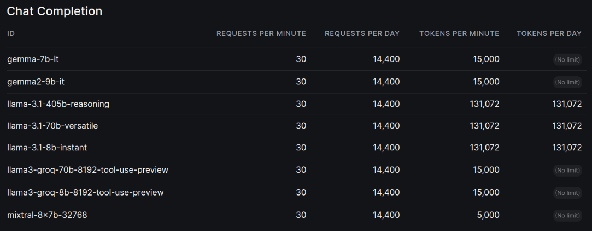
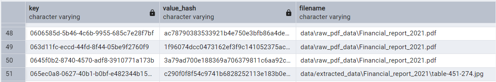
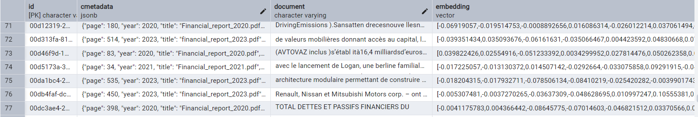
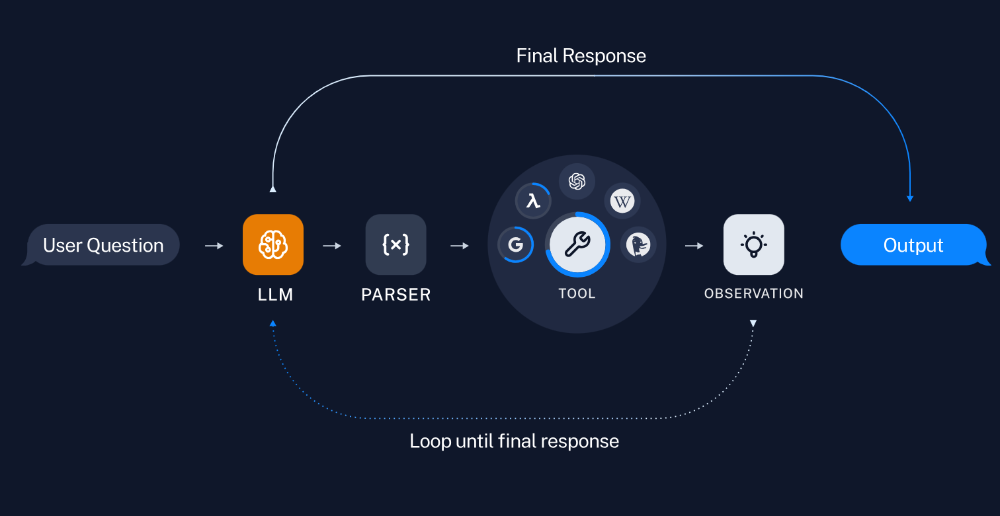

# RAG on Renault Data
Author : [Siwar ABBES](https://www.linkedin.com/in/siwar-abbes/)

The goal is to develop an LLM agent(s) that can respond to queries using structured and
unstructured multi-modal data from popular websites and APIs. The agent's knowledge base
will include information on Renault's Renaulution strategy plan, based on our CEO Luca di
Meo's talks, Renault's recent annual reports, Renault's stock prices for the current year, and
the overall performance of the CAC40.

## Table of Contents
- [Prerequisites](#prerequisites)
- [Setup](#setup)
  - [Python Environment](#python-environment)
  - [Poetry](#poetry)
  - [Environment Variables](#environment-variables)
- [Data Processing](#data-processing)
  - [Preprocessing](#preprocessing)
  - [Retrieval Database](#retrieval-database)
- [RAG System](#rag-system)
- [Renault Agent](#renault-agent)

## Prerequisites
- Poetry
- Docker
- Python 3.7+
- PostgreSQL GUI client

## Python environment

The python environment must be `python3.10` and it can be created using the following command :
`python -m venv .venv`
or
`python3.10 -m venv .venv`

Then to activate the virtual environment :
- on UNIX --> `source .venv/bin/activate`
- on Windows powershell --> `.\.venv\Scripts\activate`

### Poetry :

Poetry is a dependency management tool for Python projects.
It helps manage project dependencies, virtual environments, and packaging.
With a pyproject.toml configuration file, you can declare dependencies, versioning, and other settings

To install poetry with the project version:

`pip install -U pip setuptools`
`pip install poetry==1.8.3`

To use the python venv with poetry :

`poetry env use /full/path/to/python`

To install the project :

`poetry install`


## Environment variables

In order to use the project, you have to create a `.env` file under the root directory.
You can use the `.env-template` to know what are the environment variables to fill.

for LLMs, you can use OpenAI provider or Groq models:




## Preprocessing
We begin by setting up the Unstructured library uning tesseract-ocr to parse and pre-process pdf documents, from images to text. 
You can find the extracted data in this [folder](https://github.com/siwaar/rag-renault/tree/feat/rag/data/extracted_data)
or you can run this code:

`python .\lib\preprocessing\extract_unstructured_data_from_pdf.py`.

## Retrieval-Augmented Generation (RAG)
The RAG system workflow includes:

1. Extracting text, images, and tables from PDFs

2. Parsing YouTube transcripts

3. Chunking and summarizing data

4. Using a multimodal LLM for generating image summaries

5. Storing text/image data in the vectorstore

6. Retrieving relevant data and synthesizing answers using a multimodal LLM

## Retrieval 
Now we will establish a document retrieval system that integrates textual and visual data into a multimodal LLM, enabling comprehensive understanding and accurate, relevant responses. 
### Set up Docker environment
We used an Open-source vector similarity search for Postgres (docker image)[https://hub.docker.com/r/ankane/pgvector]


Using the`docker-compose.yml` file, run the Docker container:

```
docker-compose -f docker-compose.db.yml up -d

```
Verify the Container ankane/pgvector image is Running :
```
docker ps
```
To manage and inspect the content of your PostgreSQL database tables effectively,
installing a graphical database management tool like pgAdmin is recommended.

### Retriever
We used MultiVectorRetrieve from Langchain to retrieve using multiple vectors per document..

You need to run :

`python .\lib\retriever.py`.

This script will update the docstore with our different documents.



And it will update the vecstore with the chunks and their embeddings.




## Renault Agent
For our project, we used the ReAct type of langchain agents



The ReAct framework enables the agent to:
1. Reason about the user's query
2. Plan a series of actions (tools) to address the query
3. Execute those actions using available tools
4. Observe the results
5. Reflect on the outcomes to inform further actions

The Renault Agent is equipped with two major tools:

1. **RAG (Retrieval-Augmented Generation) Tool**:
   - Queries the vector database containing preprocessed Renault documents
   - Retrieves relevant text chunks and image summaries
   - Enables the agent to access up-to-date, company-specific information

2. **YouTube Finance Search Tool**:
   - Searches YouTube for recent financial news and analyses related to Renault
   - Provides the agent with the extracted information

### Running the Agent

To interact with the Renault Agent, run the Streamlit app:

```bash
streamlit run ./lib/renault_agent.py

